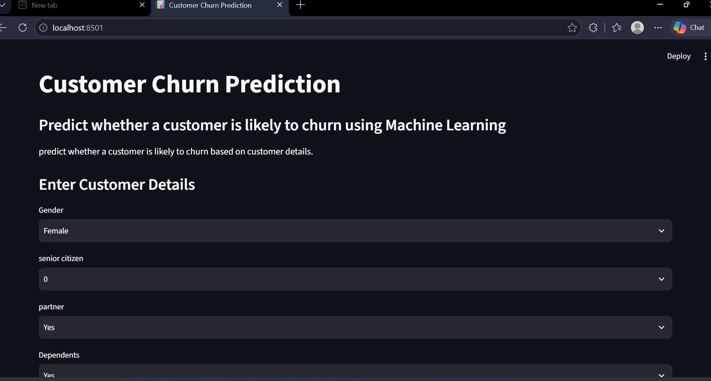
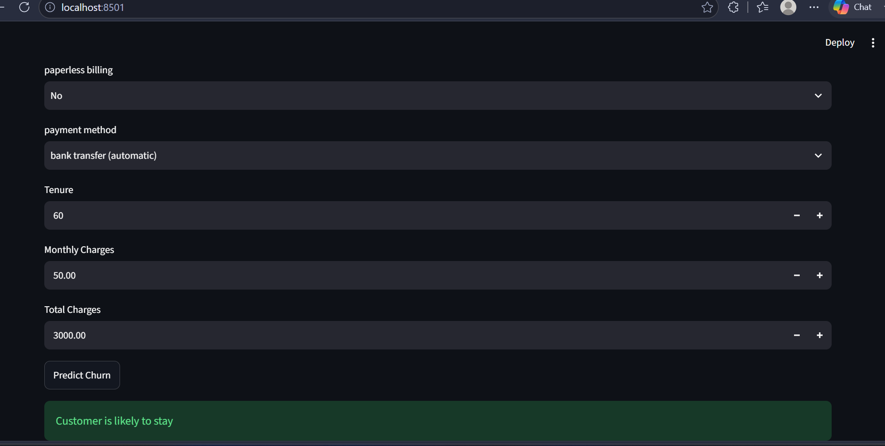
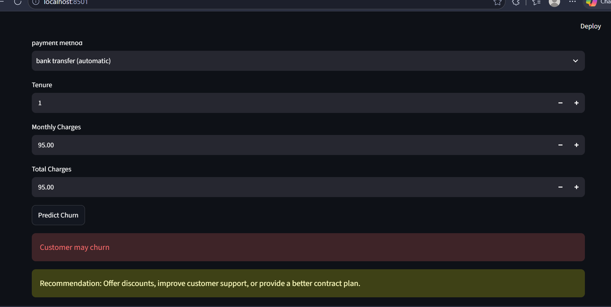

# 📊 Customer Churn Prediction

## 📌 Project Overview

Customer Churn Prediction is a Machine Learning project that predicts whether a customer is likely to leave a telecom company based on customer details. The project includes a trained ML model and a Streamlit web application for real-time predictions.

---

## 🚀 Features

- Predict customer churn
- Interactive Streamlit web application
- User-friendly interface
- Machine Learning based prediction
- Live deployment using Streamlit Cloud

---

## 🛠️ Technologies Used

- Python
- Pandas
- NumPy
- Scikit-learn
- Joblib
- Streamlit

---

## 📂 Project Structure

```
Customer-Churn-Prediction/
│
├── app.py
├── main.py
├── requirements.txt
├── README.md
├── .gitignore
├── models/
│   ├── customer_Churn_model.pkl
│   └── feature_names.pkl
└── data/
    └── WA_Fn-UseC_-Telco-Customer-Churn.csv
```

---

## ▶️ How to Run

1. Clone the repository

```
git clone https://github.com/sailajatholla-23/Customer-Churn-Prediction.git
```

2. Install dependencies

```
pip install -r requirements.txt
```

3. Run the Streamlit app

```
streamlit run app.py
```

---
## 📸 Project Screenshots

### 🏠 Home Page



### ✅ Prediction - Customer Stay



### ⚠️ Prediction - Customer Churn



## 👤 Author

**Sailaja Tholla**

GitHub:
https://github.com/sailajatholla-23

LinkedIn:
https://www.linkedin.com/in/sailaja-tholla

⭐ If you found this project useful, please give it a Star.
